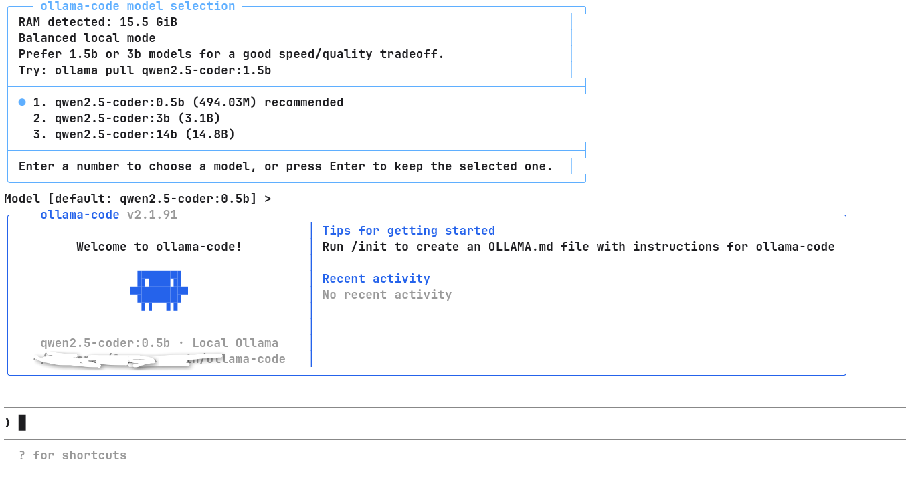

# ollama-code

`ollama-code` runs the published Claude Code CLI behind a local Anthropic-compatible Ollama shim, then patches the visible branding and defaults for local-first use.



## Goals

- keep the official CLI UI, tools, prompts, and agent loop as intact as possible
- replace Anthropic API traffic with local Ollama `/api/chat`
- provide a fast local default strategy for CPU-only machines
- expose the mirrored source tree under `src/` for deeper patching when needed

## Status

This project is usable, but it is still a compatibility layer around the published upstream Claude Code bundle.

- interactive UI comes from the upstream CLI bundle
- Anthropic traffic is translated to Ollama locally
- small local models may still produce weaker tool-calling behavior than larger models
- the source mirror under `src/` is incomplete and is included for targeted patching and analysis, not as a full rebuildable upstream checkout

## Run

```bash
cd ollama-code
node ./bin/ollama-code.mjs
```

Help:

```bash
node ./bin/ollama-code.mjs --help
```

## Environment

```bash
export OLLAMA_HOST=http://127.0.0.1:11434
export OLLAMA_MODEL=qwen2.5-coder:7b
```

If `OLLAMA_MODEL` is not set, `ollama-code` automatically picks the smallest installed local model it can find, preferring code-oriented models first.

Before chat starts, `ollama-code` shows a local model selection panel with simple recommendations based on available RAM.

## Fast Local Mode

For local CPU usage, large models can feel stalled because the upstream CLI sends a heavy system prompt and tool schema on every turn.

`ollama-code` therefore defaults to a fast-local selection strategy:

- prefer smaller installed coder models first
- fall back to the smallest installed model if no coder model exists
- preserve `OLLAMA_MODEL` exactly when you set it explicitly

Recommended small local models:

```bash
ollama pull qwen2.5-coder:1.5b
ollama pull qwen2.5-coder:7b
ollama pull qwen2.5-coder:3b
ollama pull qwen2.5-coder:0.5b
ollama pull qwen2.5:3b
```

## Architecture

`ollama-code` works like this:

- launch the official bundled CLI from `.upstream/package/cli.js`
- start the compatibility layer in `bin/anthropic-ollama-shim.mjs`
- translate Claude `/v1/messages` calls to Ollama `/api/chat`
- stream Ollama tokens back as Anthropic-style SSE events
- patch visible branding, colors, and welcome UI toward `ollama-code`

## Release Notes

If you publish this repository, keep the current constraints visible:

- this is not a clean-room reimplementation of Claude Code
- behavior depends on the bundled upstream CLI archive included in this repo
- local model quality depends heavily on the chosen Ollama model
- very small models such as `0.5b` may still behave poorly on tool-heavy prompts

## Dev Checks

```bash
npm run check
```

## Notes

This repository still depends on the published upstream CLI bundle for full behavior. The mirrored source tree is useful for analysis and targeted patching, but it is not a clean upstream checkout that can be rebuilt 1:1 by itself.

More detail: `docs/MIRROR_GAPS.md`
